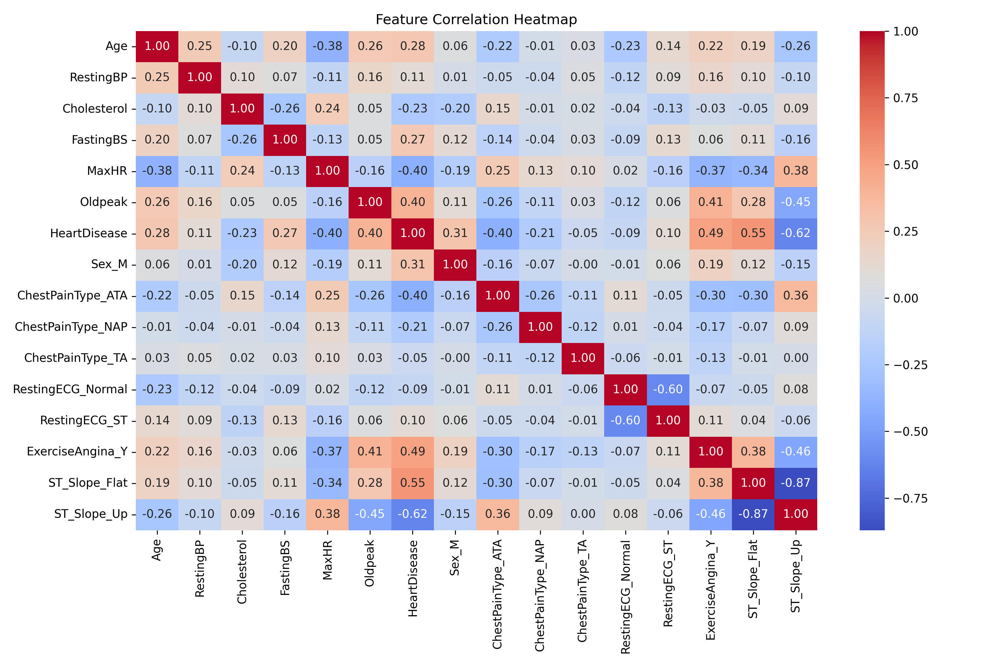
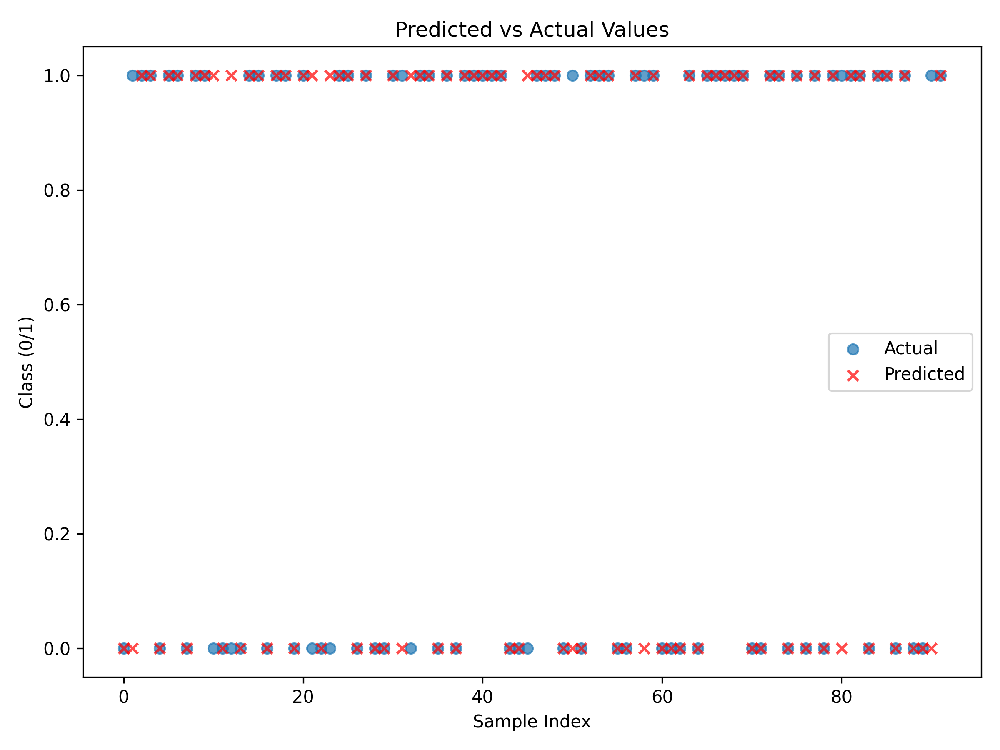

# Heart Disease Prediction using Logistic Regression

Predicting the presence of **heart disease** using **Logistic Regression** in Python with scikit-learn. This project demonstrates **supervised learning, data preprocessing, model evaluation, and visualization**.

---

## **Project Overview**

- **Goal:** Predict whether a patient has heart disease based on clinical and demographic features.  
- **Dataset:** [Heart Failure Prediction Dataset](https://www.kaggle.com/fedesoriano/heart-failure-prediction) (via KaggleHub)  
- **Skills showcased:**  
  - Data loading and exploration  
  - Encoding categorical features with LabelEncoder  
  - Feature scaling with StandardScaler  
  - Model training and evaluation with Logistic Regression  
  - Visualization of predictions, confusion matrix, and feature importance  

---

## **Workflow**

1. **Data Loading & Exploration**
   - Inspect dataset size, columns, and initial insights.  
   - Visualize the distribution of the target variable (`HeartDisease`).

2. **Preprocessing**
   - Encode categorical columns: `Sex`, `ChestPainType`, `RestingECG`, `ExerciseAngina`, `ST_Slope`.  
   - Scale numerical features for better model performance.

3. **Visualization**
   - **Target Distribution:** Class balance in the dataset.  
   - **Correlation Heatmap:** Feature relationships.  
   - **Predicted vs Actual:** Compare model predictions with actual values.  
   - **Confusion Matrix:** Show correct vs incorrect predictions.  
   - **Feature Importance:** Insights from Logistic Regression coefficients.

4. **Model Training**
   - Logistic Regression with scaled features.  

5. **Evaluation**
   - Metrics: Accuracy, Confusion Matrix, Classification Report.  
   - Visualizations to interpret predictions.

---

## **Key Metrics**

| Metric | Value |
|--------|-------|
| Accuracy | `0.8587` |
| Precision / Recall / F1-score | See Classification Report |

> Values depend on dataset split and model training.

---

## **Visualizations**

### Target Distribution

### Correlation Heatmap

### Predicted vs Actual

### Confusion Matrix

### Feature Importance

