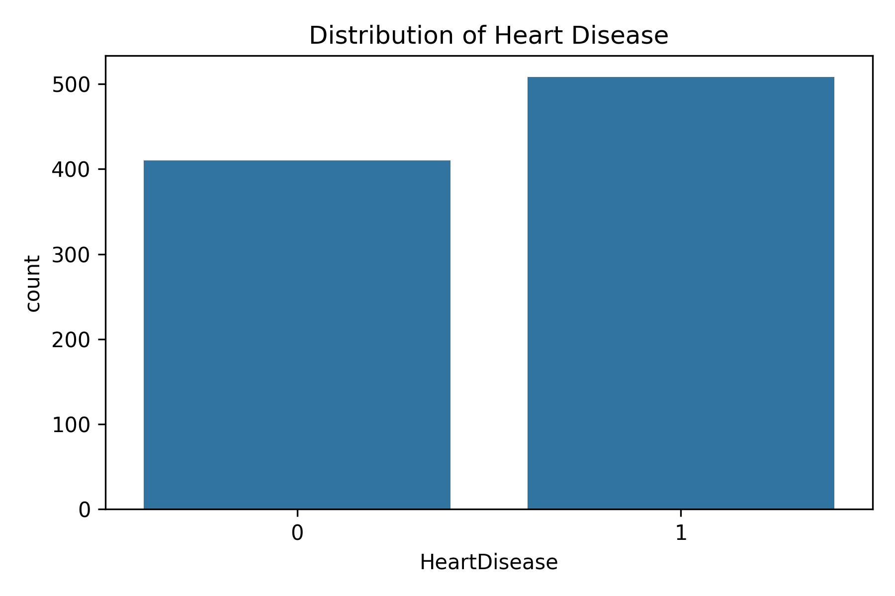

# Heart Disease Prediction using Logistic Regression

Predicting heart disease using **Logistic Regression** with Python and scikit-learn.  
This project demonstrates **supervised learning, data preprocessing, model evaluation, and visualization**.

## Project Overview

- **Goal:** Predict whether a patient has heart disease based on clinical features.  
- **Dataset:** [Heart Failure Prediction Dataset](https://www.kaggle.com/datasets/fedesoriano/heart-failure-prediction) (via KaggleHub)  
- **Skills showcased:**  
  - Data loading and exploration  
  - Encoding categorical features with One-hot Encoding  
  - Feature scaling using StandardScaler  
  - Training a Logistic Regression model  
  - Evaluating with Accuracy, Log Loss, and Classification Report 
  - Performing 5-Fold Cross-Validation
  - Visualizing predictions, residuals, and feature importance  

## Workflow

1. **Data Loading & Exploration**
   - Inspect dataset size, columns, and first few rows.  
   - Check for categorical and numerical features.

2. **Preprocessing**
   - Encode categorical columns using LabelEncoder.  
   - Scale features using StandardScaler.

3. **Visualization**
   - **Target distribution:** Understand class imbalance.  
   - **Correlation heatmap:** Identify relationships between features.  

4. **Model Training**
   - Train a Logistic Regression model on the training set.
   - Perform 5-Fold Cross-Validation to evaluate model performance

5. **Evaluation**
   - **Metrics:** Accuracy and Log Loss.  
     - **Accuracy:** How many predictions match the actual values.  
     - **Log Loss:** Measures how confident the model is about its predictions (lower is better).  
   - **Classification report:** Precision, recall, and F1-score for each class.  
   - **Visualizations:** Confusion matrix, predicted vs actual scatter plot, and feature importance.

## Key Metrics

| Metric                        | Value                     | Explanation                                                             |
|-------------------------------|---------------------------|-------------------------------------------------------------------------|
| Accuracy                      | 0.8696                    | Fraction of correct predictions (about 87%).                            |
| Log Loss                      | 0.3615                    | Measures how confident the model is about predictions.(Lower is better) |
| 5-Fold CV Accuracy            | 0.8671                         | The average accuracy across all splits.                                 |
| 5-Fold CV Log Loss            |  0.3439                        | The average log loss across all splits.                                 |
| Precision / Recall / F1-score | See Classification Report | Evaluates performance per class (0 = no disease, 1 = disease).          |

> Metrics may vary slightly depending on train-test split and random state.

## Visualizations

### Target Distribution

**Purpose:** To show the balance or imbalance of the target variable, **HeartDisease**, in the dataset prior to training.
**What it means:**
* **X-axis (HeartDisease):** Represents the two outcome classes: **0 (No Disease)** and **1 (Disease)**.
* **Y-axis (count):** Shows the raw count of patients for each class. The height of the bars shows the frequency of each outcome.
* The plot confirms the dataset is relatively **balanced**, with a slightly higher count of patients having heart disease (Class 1, count $\approx 500$) than those without (Class 0, count $\approx 410$).

### Correlation Heatmap

**Purpose:** This shows how strongly every pair of features in the data is related to each other.
**What it means:**
* **Color and Number:** The number inside each box (from **-1.00 to +1.00**) shows the strength of the relationship.
* **Warm Colors (Red):** Closer to +1.00 means a **positive correlation**; as one feature value increases, the other feature value also tends to increase.
* **Cool Colors (Blue):** Closer to -1.00 means a **negative correlation**; as one feature value increases, the other feature value tends to decrease.
* **Axes:** All preprocessed features and the target (`HeartDisease`) are listed on both sides.
* By looking at the `HeartDisease` row/column, features like **`ST_Slope_Flat` (0.55)**, **`ExerciseAngina_Y` (0.49)**, and **`Oldpeak` (0.43)** show a strong positive relationship with heart disease. Conversely, **`MaxHR` (-0.40)** shows a moderate negative relationship.

### Predicted vs Actual

**Purpose:** To visually compare the Logistic Regression model's binary predictions (0 or 1) against the true actual values for each sample in the test set.
**What it means:**
* **X-axis (Sample Index):** Represents the unique index of each patient in the test set.
* **Y-axis (Class (0/1)):** Represents the binary outcome: **0 (No Disease)** or **1 (Disease)**.
* **Blue Circles (Actual):** These are the true class labels for the patients.
* **Red 'x' Marks (Predicted):** These are the class labels the model guessed.
* **Interpretation:** Points where the red 'x' and blue circle overlap indicate a **correct classification** (True Positive or True Negative). Misalignment indicates an **incorrect classification**. The high degree of overlap demonstrates the model's high accuracy (Accuracy: 0.8696) on the test set.

### Confusion Matrix

**Purpose:** To summarize the performance of the classification model by counting the number of correct and incorrect predictions for each class on the test set.
**What it means:**
* **Rows (Actual):** Represent the true class of the data points. The top row is **Actual 0 (No Disease)**, and the bottom row is **Actual 1 (Disease)**.
* **Columns (Predicted):** Represent the class predicted by the model. The left column is **Predicted 0**, and the right column is **Predicted 1**.
* **Top-Left (32):** This is the count of **True Negatives (TN)**, where the model correctly predicted **32** patients did **not** have heart disease.
* **Top-Right (6):** This is the count of **False Positives (FP)**, where the model incorrectly predicted **6** healthy patients **have** heart disease (Type I error).
* **Bottom-Left (6):** This is the count of **False Negatives (FN)**, where the model incorrectly predicted **6** sick patients **do not** have heart disease (Type II error).
* **Bottom-Right (48):** This is the count of **True Positives (TP)**, where the model correctly predicted **48** patients **have** heart disease.
* The model shows an equal number of False Positives and False Negatives (6 of each) on this test set.

### Feature Importance

**Purpose:** To show which features are most important in predicting heart disease and whether they increase or decrease the risk.
**What it means:**
* **X-axis (Coefficient):** The size of the number shows how strongly a feature affects the prediction. Positive numbers increase the risk, negative numbers decrease it.
* **Y-axis (Feature):** Lists all features in the dataset.
* **Positive coefficients (right side):** Features which increases the chance of heart disease.  
  * Example: **`ST_Slope_Flat`** – having a flat ST segment on an ECG strongly raises risk.  
* **Negative coefficients (left side):** Features which decreases the chance of heart disease.  
  * Example: **`ChestPainType_ATA`** – having atypical angina lowers risk.
* **Bar Size:** The length of the bar represents the absolute magnitude (strength) of the coefficient. A longer bar indicates a feature has a larger impact (positive or negative) on the heart disease prediction. A shorter bar indicates a feature has a smaller impact.

## Contact

If you’d like to connect or discuss this project:
- **LinkedIn:** [Parinita Chandan](https://www.linkedin.com/in/parinitachandan/)
- **GitHub:** [github.com/parinitachandan](https://github.com/parinitachandan)
