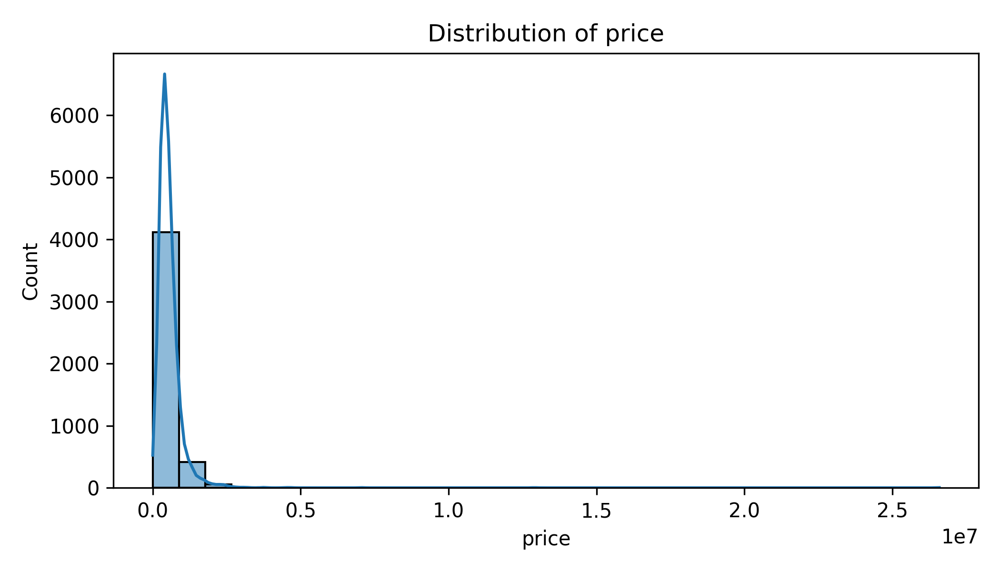
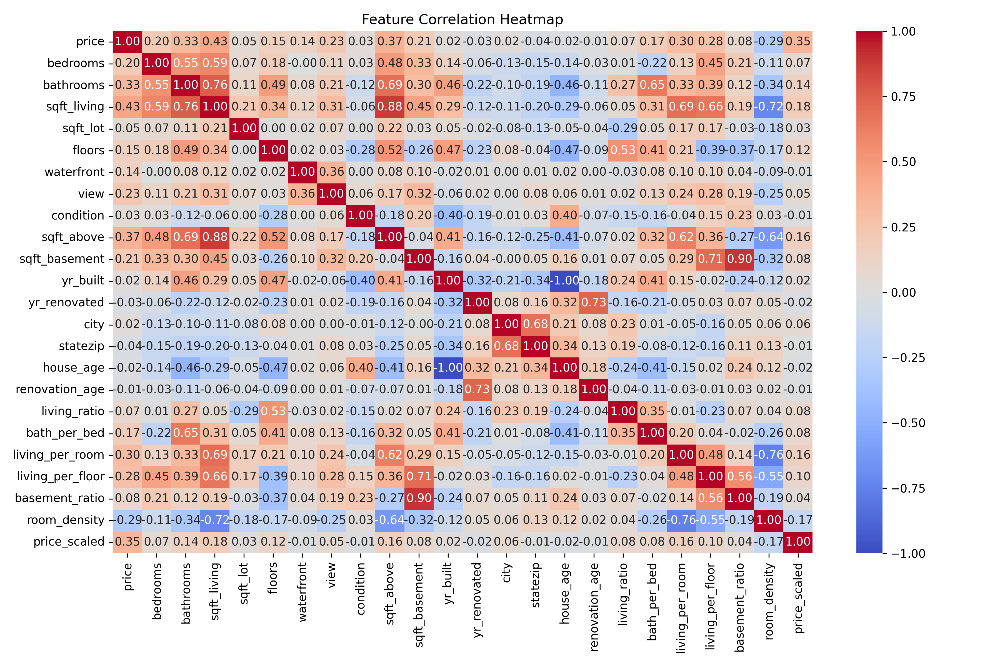

# House Price Prediction using Linear Regression

Predicting house prices using **Linear Regression** with Python and scikit-learn. This project demonstrates **supervised learning, data preprocessing, and model evaluation** in a clear and concise workflow.

---

## Project Overview

- **Goal:** Predict house prices based on various features (location, area, number of rooms, etc.) using linear regression.  
- **Dataset:** `https://www.kaggle.com/datasets/shree1992/housedata/data` (KaggleHub)  
- **Skills showcased:**  
  - Data loading and exploration  
  - Handling categorical features with Label Encoding  
  - Feature scaling using StandardScaler  
  - Model training and evaluation  
  - Visualization of predictions and residuals  

---

## Workflow

1. **Data Loading & Exploration**
   - Inspect dataset size, columns, and summary statistics.
   - Check for categorical and numerical features.

2. **Preprocessing**
   - Encode categorical columns using LabelEncoder.
   - Scale features for linear regression.

3. **Visualization**
   - **Target distribution:** Understand the spread of house prices.
   - **Correlation heatmap:** Identify relationships between features.
   - **Predicted vs Actual:** Compare model predictions with actual prices.
   - **Residual distribution:** Check errors for patterns.

4. **Model Training**
   - Train a Linear Regression model on the training set.

5. **Evaluation**
   - Metrics: Mean Squared Error (MSE) and R² score.  
   - Visualizations for understanding model performance.

---

## Key Metrics

| Metric | Value |
|--------|-------|
| Mean Squared Error (MSE) | `55078285843.8443` |
| R² Score | `0.5716` |

> Metrics will vary depending on the dataset and train-test split.

---

## Visualizations

### Target Distribution

### Correlation Heatmap

### Predicted vs Actual

### Residual Distribution

