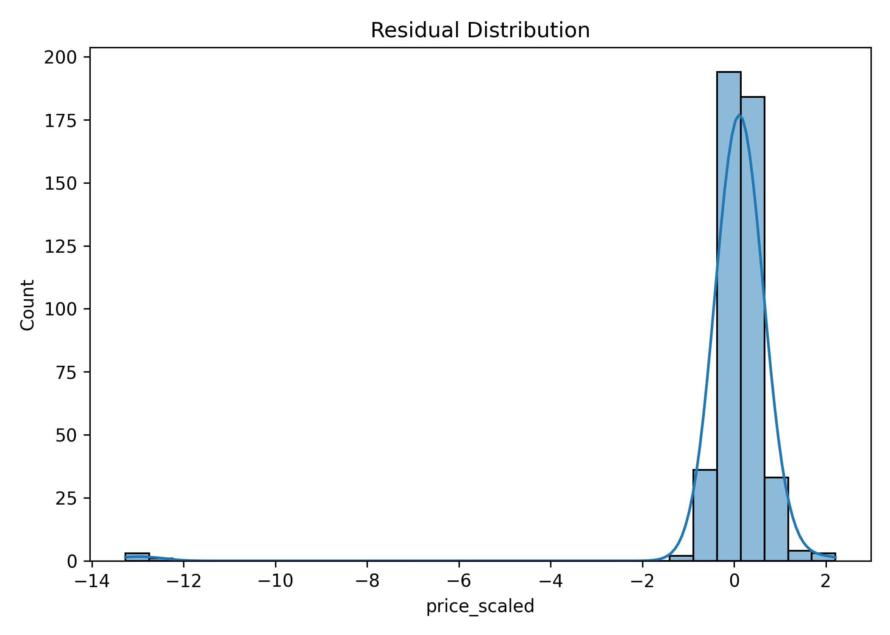

# House Price Prediction using Linear Regression

Predicting house prices using **Linear Regression** with Python and scikit-learn. This project demonstrates **supervised learning, data preprocessing, feature engineering, and model evaluation** in a simple yet powerful workflow.

---

## Project Overview

- **Goal:** Predict house prices based on features like location, area, number of rooms, age, and renovations using linear regression.  
- **Dataset:** [House Price Prediction Dataset](https://www.kaggle.com/datasets/shree1992/housedata/data) (via KaggleHub)  
- **Skills showcased:**  
  - Data loading and exploration  
  - Handling categorical features with Label Encoding  
  - Feature engineering (house age, renovation age, living space ratio, bathrooms per bedroom)  
  - Scaling features and log-transforming the target  
  - Model training and evaluation  
  - Visualization of predictions and residuals  

---

## Workflow

1. **Data Loading & Exploration**
   - Inspect dataset size, columns, and summary statistics.
   - Check for categorical and numerical features.

2. **Preprocessing**
   - Encode categorical columns using LabelEncoder.
   - Feature engineering:
     - `house_age` = 2025 - `yr_built`  
     - `renovation_age` = 2025 - `yr_renovated` (0 if never renovated)  
     - `living_ratio` = `sqft_living` / `sqft_lot`  
     - `bath_per_bed` = `bathrooms` / `bedrooms`  
   - Log-transform the target (`price`) to stabilize variance and reduce skew.

3. **Visualization**
   - **Target distribution:** Understand the spread of house prices.  
   - **Correlation heatmap:** Identify relationships between features.  
   - **Predicted vs Actual:** Compare model predictions with actual prices.  
   - **Residual distribution:** Check errors for patterns.

4. **Model Training**
   - Train a Linear Regression model on scaled features.

5. **Evaluation**
   - Metrics: **Mean Squared Error (MSE)** and **R² score**.  
   - Visualizations for understanding model performance.  
   - Sample of original and scaled prices for clarity.

---

## Key Metrics

| Metric | Value | Explanation |
|--------|-------|-------------|
| Mean Squared Error (MSE) | 5.5078 | Measures the average squared difference between predicted and actual log-scaled prices. Smaller values = better predictions. |
| R² Score | 0.5716 | Proportion of variance explained by the model. Closer to 1 = better fit. |

> Note: MSE is calculated on **log-transformed prices**, making it easier to interpret and compare errors.

## Visualizations

### Target Distribution

**Purpose:** This shows how the original house prices are spread out.
**What it means:**

| Component      |	What it Represents|	What it Tells Us|
|----------------|-------|-------------|
|X-axis (price)	 |The original house price values.|	Prices range from near zero up to about $27.5 million.|
|Y-axis (Count)	 |The number of houses that fall within each price range (bin).	|The height of the bars shows how common a price is.|
|Bars/Curve}     |	The frequency distribution of all house prices.	|Shows the shape of the price data.|

* The plot clearly shows a very unequal spread in house prices, which is known as a heavy skew (or right-skew). 
* Most Houses are Cheap: The count is extremely high (over 6,000) for the lowest price ranges (near $0). This means most houses in the dataset are clustered at the inexpensive end. 
* Few Houses are Expensive: The count drops off almost immediately, with very few houses scattered far to the right. These represent a handful of extremely expensive homes (the long tail).

### Correlation Heatmap

**Purpose:** This shows how strongly every pair of features in the data is related to each other.
**What it means:**
* **Color and Number:** The number inside each box (from **-1.00 to +1.00**) shows the strength of the relationship.
    * **Red** (closer to +1.00) means a **positive relationship** (as one goes up, the other goes up). For example, **`sqft_living` (0.68)** is strongly related to `price`.
    * **Blue** (closer to -1.00) means a **negative relationship** (as one goes up, the other goes down). For example, **`house_age` (-0.50)** is moderately related to `price`.
    * **White/Gray** (closer to 0.00) means **no strong relationship**.
* **Axes:** All the features are listed on both sides. Look at the last row (`price_scaled`) to quickly see which features most impact the house price.

---

### Predicted vs Actual

**Purpose:** This checks how well the model's predictions match the real prices in the test data.
**What it means:**
* **X-axis (Actual):** The true price (after log-transforming).
* **Y-axis (Predicted):** The price the model guessed (after log-transforming).
* **Red Dashed Line:** This is the **perfect prediction line**.
* **Blue Dots:** Each dot is a house. The closer a dot is to the red line, the more accurate the prediction was. The cluster of points close to the line shows the model performs reasonably well, especially for the higher-priced homes.
---

### Residual Distribution

**Purpose:** This looks at the **errors** the model made (Residual = Actual Price - Predicted Price). Good models usually have errors that are centered around zero and look like a bell curve.
**What it means:**
* **X-axis:** The size of the **error** (residual). An error of **0** is a perfect prediction.
* **Y-axis (Count):** The frequency of each error size.
* The plot shows errors are mostly **centered near zero**, which is good. However, there's a small group of very large **negative errors** (far left). A negative error means the **model guessed too high** (overestimated the price) for a few houses. This suggests the model might be struggling with a few extreme, low-priced houses.
---

## Contact

If you’d like to connect or discuss this project:
- **LinkedIn:** [Parinita Chandan](https://www.linkedin.com/in/parinitachandan/)
- **GitHub:** [github.com/parinitachandan](https://github.com/parinitachandan)
---